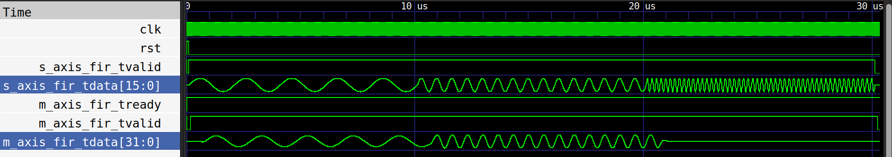

# FIR Filter with Adder Tree Optimization

## Overview
This repository contains the RTL implementation and verification environment for an optimized FIR filter architecture, targeting low-power and efficient VLSI designs. The project focuses on optimizing a classic FIR filter using techniques such as adder-tree based accumulation, pipelining, and area-aware design decisions.

For efficient resource utilization, the FIR implements an adder tree. This adder tree aims to improve latency by reducing the critical path (data arrival time and data required time). An example of the architecture is shown in the following figure.


## Key Features
- **Balanced Adder Tree**: Reduces critical path by summing partial products in a log-depth tree.
- **Inferred Clock Gating**: Uses clock-enable signals to reduce switching activity and dynamic power (synthesis friendly).
- **Optimized Latency**: 10-cycle latency (down from 16) with full pipelining.
- **Verilog RTL**: Compatible with Icarus Verilog, Verilator, and standard synthesis flows.

## Installation

### Install System Tools (Ubuntu / Debian)

```bash
sudo apt update
sudo apt install -y iverilog gtkwave make
```

### Setup Python Environment

Ensure you have Poetry installed. Then, run the following in the project root:

```bash
# Install dependencies into a virtual environment
poetry install

# Activate the virtual environment
poetry shell
```

## FIR Coefficient Generation

The FIR coefficients are generated offline using Python.

To regenerate coefficients:

```bash
cd src
python3 filter_design.py
```

**Notes:**
- The script designs a band-pass FIR filter using fixed-point (Q15)
- The number of taps and cutoff frequencies are configurable (default: 5–50 Hz)
- If parameters are unchanged, regeneration is optional

## Running Simulations

### Verilog Testbench (Icarus Verilog & GTKWave)

The Verilog testbench provides cycle-accurate simulation and waveform visualization. The testbench is located at `tb/verilog/tb_fir.v`.

#### Running the Verilog Testbench

```bash
# Run simulation and generate waveforms
make test-verilog

# View waveforms in GTKWave (auto-loads saved signal configuration)
make view-verilog
```



**Workflow:**
1. `make test-verilog` compiles the RTL and testbench with Icarus Verilog and runs the simulation
2. The simulation generates `wave.vcd` waveform file
3. `make view-verilog` opens GTKWave with pre-configured signals (`wave.gtkw`)
4. GTKWave automatically displays key signals including `m_axis_fir_tdata` and `s_axis_fir_tdata`

**Verification Scope:**
- Clock and reset behavior
- FIR coefficient initialization  
- Input/output data alignment across pipeline stages
- Critical path timing and latency
- Visual inspection of signal waveforms (e.g., sine wave output)

**Manual Commands (Alternative):**
```bash
# Compile and simulate
iverilog -g2005-sv -o sim_rtl.out src/fir.v tb/verilog/tb_fir.v
vvp sim_rtl.out

# View waveforms
gtkwave wave.gtkw
```

### Cocotb Verification (Python-Based)

The cocotb testbench automates functional verification against a Python reference model. The testbench is located at `tb/cocotb/test_fir.py` and tests the design with various signal types.

#### Running the Cocotb Testbench

```bash
# Run functional tests with Verilator
make test-cocotb

# View generated FST waveforms (with auto-loaded signals via TCL script)
make view-cocotb
```

**Workflow:**
1. `make test-cocotb` runs the Verilator simulation with cocotb Python tests
2. Drives Q15 fixed-point test vectors to the FIR module
3. Captures RTL outputs and compares against Python golden reference
4. Generates `dump.fst` waveform, HTML reports, plots, and detailed logs
5. `make view-cocotb` opens GTKWave with signals auto-loaded via `tcl_scripts/signals.tcl`

**Verification Scope:**
- Numerical accuracy verification against reference model
- Filter behavior validation across multiple test datasets
- Automated regression testing
- Performance and correctness metrics

### Test Vectors

Provided datasets:
- Real neural LFP recordings: `test_files/lfp`
- Synthetic signals and noise: `test_files/synthetic_noise`

Input files can be switched in testbench configuration.

## Conclusion

The FIR architecture is optimized for:
- Reduced critical path using balanced adder trees
- Lower switching activity through pipelining and gating
- Area-efficient implementation suitable for neuromorphic signal processing

Both Verilog and cocotb testbenches are supported for flexible verification.

